# miSalle

Ir a la [documentación](#documentación)

miSalle fue un producto dirigido a los alumnos de la Universidad De La Salle Bajío,
hecho por un alumno, pero el servidor de la app fue bloqueado por la administración de la institución.

En este repositorio encontrarás la parte del servidor que obtiene la información de los alumnos,
y la regresa como un `json` listo para su consumo.

## Features

Con miSalle puedes obtener:

- Información del alumno
- Horario
- Créditos
- Calificaciones 

## Prerequisitos

Para utilizar miSalle necesitarás:

- `ruby 2.4.0`
- `postgresql`
- `bundle`

## Instalación

```
$ git clone https://github.com/lalo2302/miSalleScrapper.git
$ cd miSalleScrapper
$ bundle install
$ rake db:create
$ rake db:migrate
```

## Usar

Para correr miSalle:
```
bundle exec rakup -p 3000
```

### Usar rutas

Para obtener la información del alumno, teniendo su matricula, contraseña y sistema:

Ejemplo de sistema:

- Lomas del campestre:
  - Licenciatura: 1
  - Profesional asociado: 4
  - Especialidad: 5
  - Maestría: 6
- Juan Alonso de Torres
  - Preparatoria: 43
- Américas
  - Preparatoria: 33
- Salamanca
  - Licenciatura 1: 20
  - Licenciatura 2: 21
  - Preparatoria: 23
  - Especialidad: 25
  - Maestría: 26
- San Francisco del Rincón
  - Secundaria: 12
  - Preparatoria: 13

Información de un alumno:
```
curl -H "Content-Type: application/json" -X POST -d '{"matricula": "XXXXX", "password": "XXXXXX", "sistema": X}' http://localhost:3000/api/v1/alumno
```

Créditos de un alumno:
```
curl -H "Content-Type: application/json" -X POST -d '{"matricula": "XXXXX", "password": "XXXXXX", "sistema": X}' http://localhost:3000/api/v1/creditos
```

Calificaciones de un alumno:
```
curl -H "Content-Type: application/json" -X POST -d '{"matricula": "XXXXX", "password": "XXXXXX", "sistema": X}' http://localhost:3000/api/v1/periodos
```

### Descripción del sistema (en progreso)

El login solo es para verificación de los datos. Para no necesitar el login, dirígete a `navegador.rb`

En este archivo se encuentra la lógica sobre la navegación a las diferentes rutas de la universidad,
para la obtención de los datos. Específicamente en el método `Navegador.parsear`
```
navegador.rb
```

Dependiendo qué información se desea consultar, se envia a uno de estos archivos para transformarla
y poderla manipular
```
parser/
```

# Documentación

1. [Análisis](#análisis)
   1.1 [Análisis](#análisis-base)
   1.2 [Descripción del problema](#descripcion-del-problema)
   1.3 [Impacto al alumno y a la institución](#impacto-al-alumno-y-a-la-institucion)
   1.4 [Antecedentes](#antecedentes)
   1.5 [Objetivo](#objetivo)
   1.6 [Alcance](#alcance)
   1.7 [Fuera del alcance](#fuera-del-alcance)
   1.8 [Costo](#costo)
   1.9 [Beneficio](#beneficio)
   1.10 [Futuro](#futuro)
   1.11 [Requerimientos Funcionales](#requerimientos-funcionales)
   1.12 [Requerimientos No Funcionales](#requerimientos-no-funcionales)
   1.13 [Riesgos](#riesgos)
   1.14 [Análisis de sistema](#análisis-de-sistema)
   1.15 [Análisis de pantallas](#análisis-de-pantallas)
2. [Diseño de sistema](#diseño-de-sistema)
   2.1 [Diagrama de clases](#diagrama-de-clases)
   2.2 [Módulos de arquitectura](#módulos-de-arquitectura)
   2.3 [Paletas de colores](#paletas-de-colores)
   2.4 [Prototipo UI](#prototiopo-ui)

# Análisis

## Análisis Base

### Descripción del problema

Los alumnos de la Universidad De La Salle Bajío no tiene una forma natural de consumir su información relevante
a la comunidad. Con natural se refiere a nativo en la plataforma en donde se esté consumiendo.

### Impacto al alumno y a la institución

**Alumno**

El proceso de consulta e interacción con la universidad será eficaz, aumentando el nivel de comodidad del estudiante de
ser parte de la institución.

**Institución**

Se automatizarán procesos que en la actualidad significan tiempo invertido en su ejecución. El personal podrá dedicar su
tiempo a tareas menos repetitivas y aumentar la productividad de la institución en general.

### Antecedentes

Al momento del lanzamiento del proyecto para ver:

- Horario
- Calificaciones
- Créditos
- Maestros

Se necesitan los siguientes pasos:

1. Abrir navegador
2. Ir a la página de la salle
3. Ir a la página de la comunidad
4. Iniciar sesión
5. Ir a consulta académica

Al momento del lanzamiento no existía competencia como tal.

### Objetivo

Crear una solución móvil que sirva de intermediario entre el alumno y la institución

### Alcance

miSalle será un intermediario entre el actual sistema de la universidad, y los dispositivos móviles del alumno

### Fuera del alcance

Si se rompe con la relación alumno-universidad, queda fuera del alcance del proyecto

### Costo

- Recursos monetarios que cueste la insfraestructura
- Recursos humanos
- Tiempo inadvertido

### Beneficio

- No hay competencia en el mercado, por lo que se podría llegar al 100% del alumnado.
- Se abre la oportunidad de colaborar con la universidad
- Abre la posibilidad de cambiar el esquema de enseñanza de la escuela

### Futuro

A pesar del alcance que se declaró, se ve a futuro las siguientes características:

- Detalles de créditos
- Plan de estudios
- Vista de horario por semana
- El alumno podrá ir anotando sus faltas para no tener que esperar a que se suban al sistema
- El usuario podrá ser creador de eventos y proyectos para compartir con el alumnado
- Se creará algún tipo de enlance entre los negocios cerca de la universidad, ya que son parte de la comunidad
- Se hará difusión sobre eventos organizados por la universidad
- Se ofrecerá ser un intermediario bancario entre el alumno y la universidad para pagos de colegiaturas, etc...
- Se creará un sistma de evaluación para maestros y materias, generando retroalimentación visible para los alumnos

## Requerimientos funcionales

1. [x] El usuario inciará sesión con sus credenciales de la universidad
2. [x] El sistema mostrará un horario que sólo recorra las horas de clase del alumno, identificando cada clase con su
nombre y el del profesor
3. [x] El sistema mostrará la siguiente clase del alumno en caso de que exista una
4. [x] El sistema mostrará las calificaciones por parcial del alumno
5. [x] El sistema mostrará la cantidad de créditos culturales, sociales y deportivos que tiene el alumno
6. [x] El sistema mostrará un aviso 5 días antes del día de vencimiento de pago de colegiatura
7. [x] El sistema mostrará las faltas del alumno por materia
8. [x] El sistema mostrará el nombre, matrícula, y carrera del alumno
9. [x] El alumno podrá subir una foto a su información personal

## Requerimientos no funcionales

1. El sistema consumirá la información de los alumnos a través de web scrapping
2. La aplicación de consumo del alumno será móvil
3. La aplicación móvil deberá existir para Android y iOS, dándole prioridad de tiempo a Android
4. El sistema sólo permitirá el ingreso de alumnos con credenciales de instituciones pertenecientes a la
Universidad De La Salle Bajío
5. La aplicación deberá ser capaz de mostrar la información del alumno sin una conexión a internet

## Riesgos

### Bloqueo de ip del scrapper por parte de La Salle

#### Descripción
Al obtener la información del sitio de La Salle por medio de scrapping, fácilmente la institución, al percatarse de la extracción de la información, puede sin ningún problema bloquear el acceso al sitio por medio de la ip.

#### Severidad
**Alta**
Es la principal fuente del sistema

#### Acción
1. En la arquitectura se observa que el scrapper estará en un nivel diferente, hospedado en Heroku. Cada 24 hrs Heroku reinicia los dynos, proporcionándole una nueva ip. En caso de que el bloqueo suceda antes, se puede reiniciar el dyno manualmente.
2. La información al ser semi-estática, se guardará en el dispositivo del usuario, para no depender del sitio de La Salle para el acceso de su información, así en cualquier evento, la interacción de los usuarios ya registrados en el sistema no se verá afectada

### Cambio de formato en sitio web de La Salle

#### Descripción
El sistema al hacer scrapping al sitio de La Salle, depende del como la información es presentada en el buscador. Si la institución decide cambiar el esquema del html, el scrapper dejaría de funcionar efectivamente

#### Severidad
**Media**
Esto llevaría a rediseñar el scrapper para que satisfaga las necesidades del esquema html de la institución

#### Probabilidad
**Baja**
El sitio está pobremente diseñado, y al parecer fuertemente atado al cómo la información es guardada en su almacén de datos. El rediseño implica un esfuerzo enorme, que la institución no logrará a corto plazo.
También se sabe que en el primer semestre del año, la universidad analiza y distribuye el presupuesto de la institución, poniendo a trabajar el dinero en el segundo semestre. Esto nos da tiempo para crear una base de usuarios solida y para estar listos para el nuevo ingreso en Agosto

#### Acción
Diseñar el sistema de una manera que los cambios del scrapper sean en 1 sólo lugar, sin afectar la funcionalidad de todo lo demás

### Insuficiencia de fondos ($) para mantener el sistema

#### Descripción
El equipo de trabajo actualmente no cuenta con inversionistas mayores, por lo que el proyecto se está llevando a cabo con recursos propios. Esto significa una limitada disposición de fondos para la contratación de desarrolladores y para pagar servidores

#### Severidad
**Mediana**
En el momento que la demanda económica del proyecto crezca como para no ser capaces de soportar los gastos, significa que la base de usuarios y el tráfico son constantes, consecuentemente el valor del proyecto crece y se puede buscar una manera de financiar el proyecto con bases más sólidas

#### Probabilidad
**Mediana**
El equipo de trabajo no cuenta con la experiencia necesaria para poder calcular el costo del tráfico próximo a generar.

#### Acción
1. Se utilizará el paquete de estudiante que ofrece GitHub para el desarrollo del proyecto
2. Se utilizarán los dominios proporcionados por heroku (~~~.herokuapp.com) para el scrapper y para el api
3. Se generarán ingresos con el modelo de negocio del proyecto

## Análisis de sistema

### Arquitectura de alto nivel

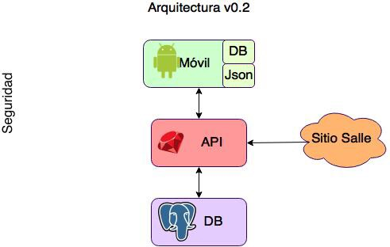

### Diagrama de flujo de datos

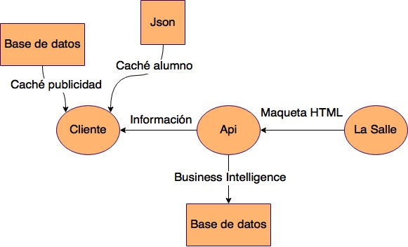

## Análisis de pantallas

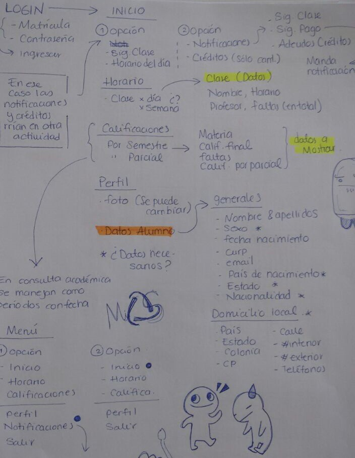

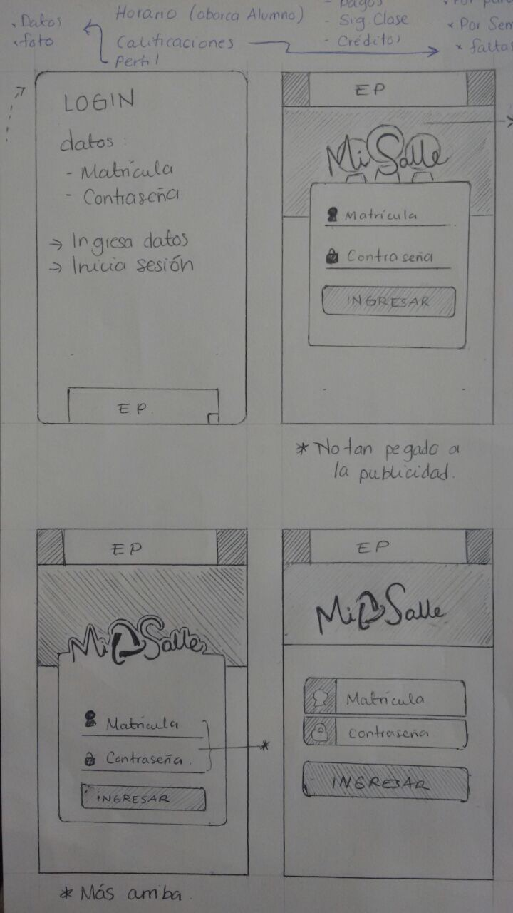

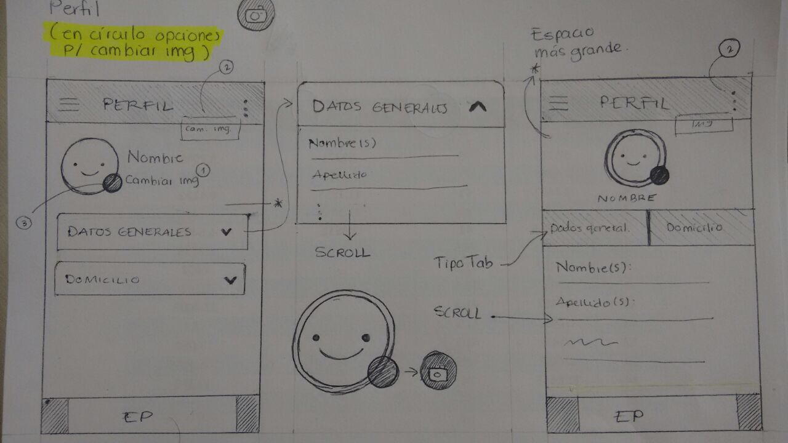

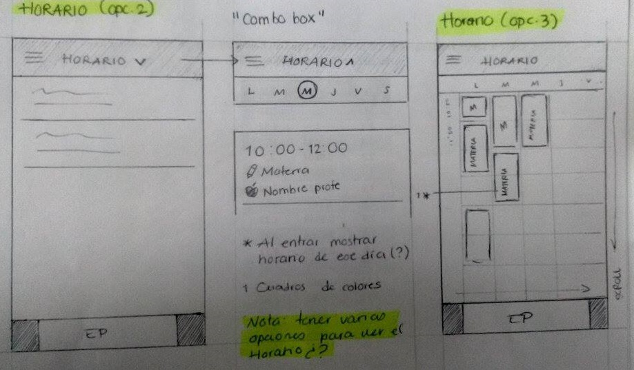

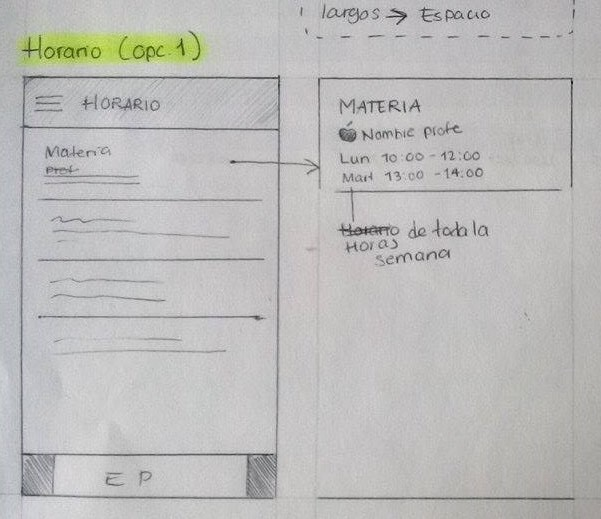

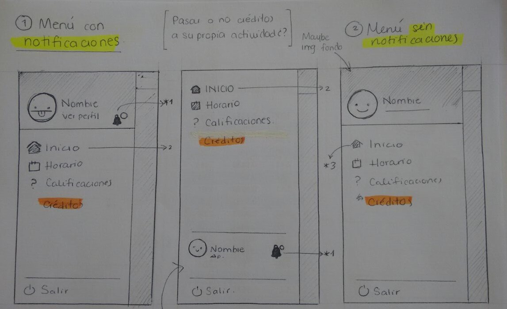

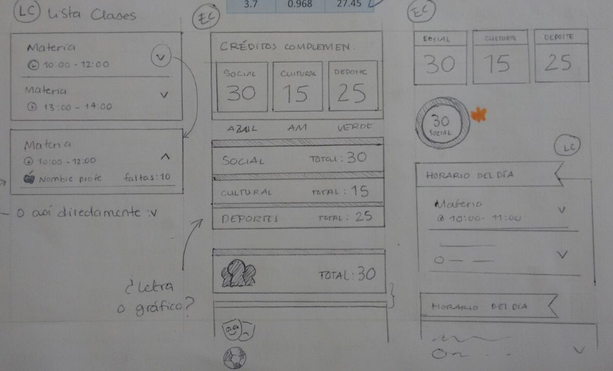

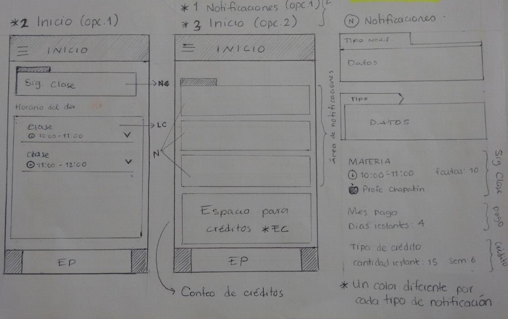


# Diseño de sistema

## Diagrama de clases

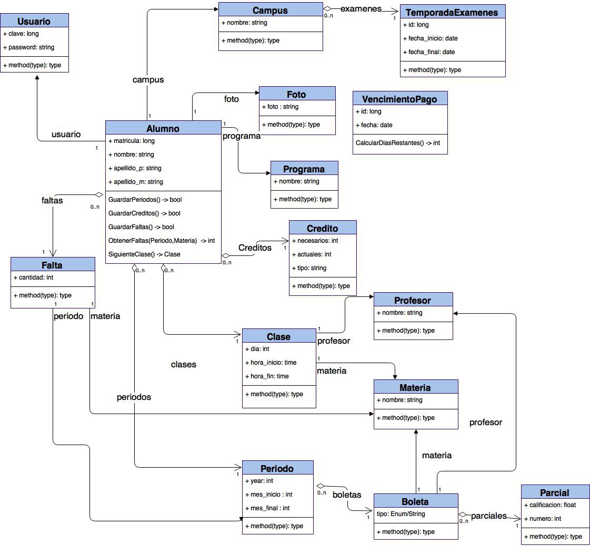

## Módulos de arquitectura

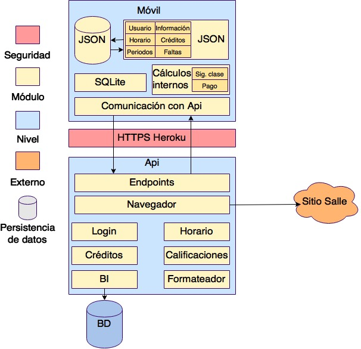

## Paletas de colores


## Prototipo UI

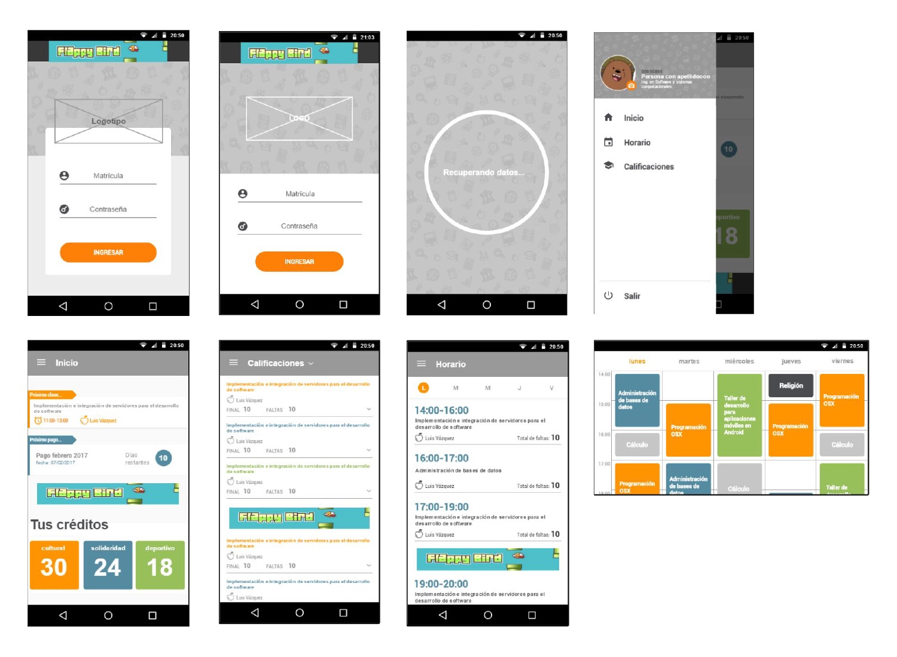
